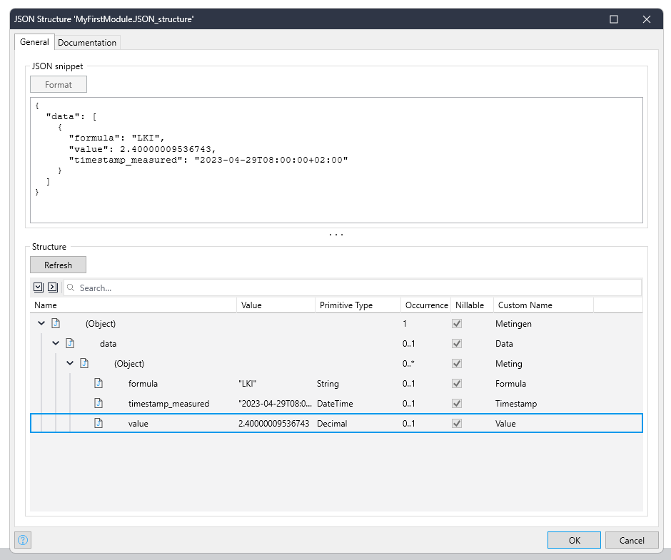
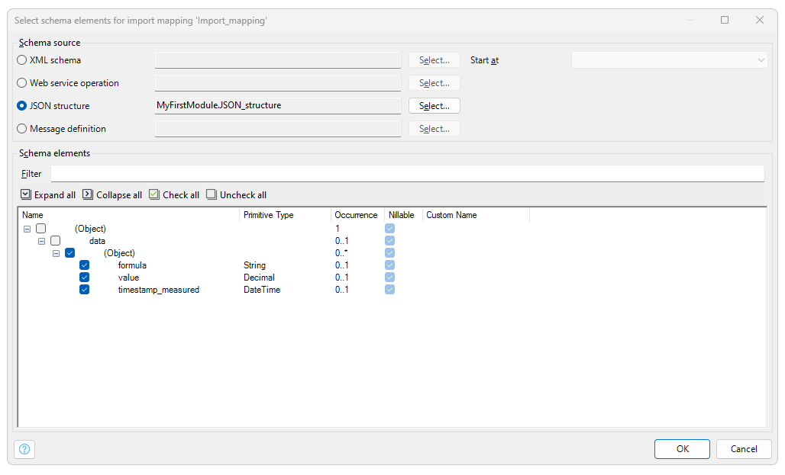
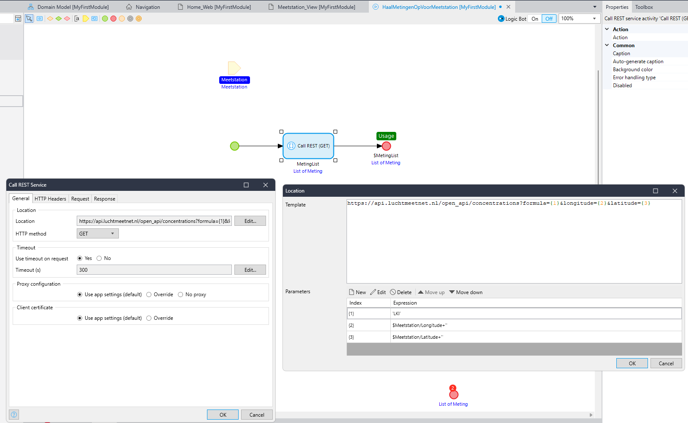
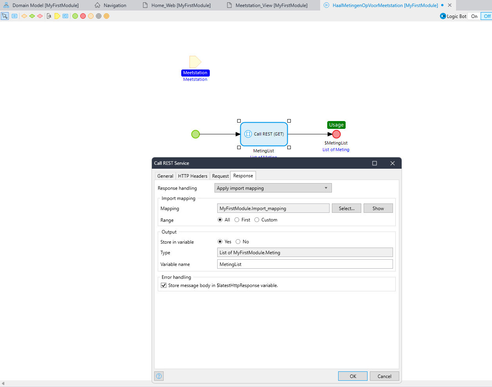

# Aansluiten op luchtmeetnet

> Als gebruiker wil ik dat de app aangesloten is op de Luchtmeetnet API, zodat ik de luchtkwaliteitsindex per locatie kan ophalen

- Gebruik de luchtmeetnet API:
  - https://api.luchtmeetnet.nl/open_api/concentrations?formula=LKI&longitude={1}&latitude={2}
  - LKI staat hierin voor 'LuchtKwaliteitIndex' 
  - De longitude `{1}` en latitude `{2}` moeten gevuld worde met de coordinaten van de meetlocatie

### Hints
- Voeg een `JSON Structure` toe aan de module
    
    ```json
    {
        "data": [
            {
                "formula": "LKI",
                "value": 2.40000009536743,
                "timestamp_measured": "2023-04-29T08:00:00+02:00"
            }
        ]
    }
    ```

- Geef de velden een logische `Custom name`

    

- Voeg een import mapping toe, gebaseerd op de `JSON Structure`, vink alleen het onderste `(Object)` aan

  

- Klik op 'Map automatically' en check daarna het `Domain model`!

- Maak een nieuwe `Microflow` aan om de luchtkwaliteit mee op te halen
- Voeg een `Input Parameter` toe van het type `Object`, kies hierbij je locatie entiteit
- Voeg een `Call REST` actie toe aan de microflow
- Stel de Location in op die hierboven, met parameters voor `{1}` en `{2}`

  

- Stel bij Response de Import mapping in die je net hebt aangemaakt
- Sla de response op in een variable en stel die in als output van de `microflow`

  

- Done!
