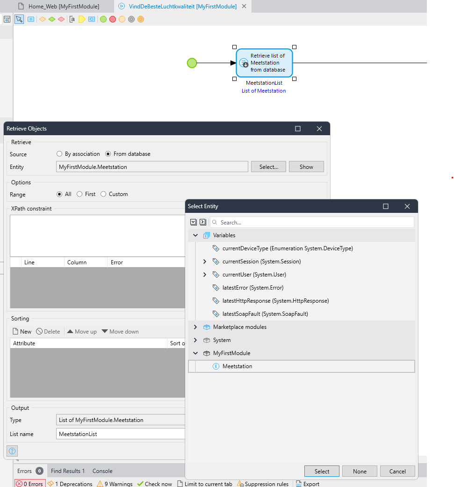

# Locatie met beste luchtkwaliteit vinden

> Als gebruiker wil ik vanaf de homepagina met één druk op de knop de locatie met de beste luchtkwaliteit vinden en weergeven op de kaart, zodat ik ze niet allemaal hoef aan te klikken

De locatie moet met een apart icoontje op de kaart worden weergegeven

### Hints
- Voeg twee attributen toe aan de locatie `Entity`
    - LaatsteMeting (decimal)
    - IsBeste (Boolean)
- Maak een nieuwe microflow aan
- Voeg een `Retrieve` actie toe en haal daarmee alle locaties uit de database
        
    

- Voeg een loop toe en itereer over de locaties
- Roep per locatie de API aan met de microflow die je eerder hebt gemaakt
- Haal de laatste meting uit de resultaten met een `List operation` (`Head`)

    

- Pas de locatie aan
    - Zet IsBeste op False
    - Vul LaatsteMeting in
    - Sla het object op

    

- Haal na de loop de beste locatie op uit de database door te sorteren op waarde
- Zet bij deze locatie IsBeste op true
- Sla het object op (met refresh)

    

- Voeg de microflow toe aan de home pagina
- Voeg een extra Marker List toe aan de Maps widget
- Filter hierbij op de beste locaties

    

- Run de app