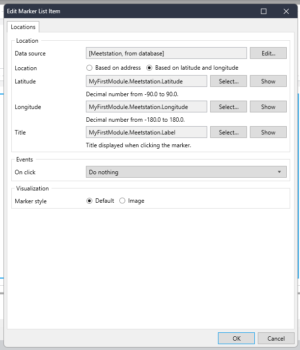

## Locaties op de kaart weergeven
> Als gebruiker wil ik dat de locaties die in de app beschikbaar zijn op een kaart op de homepagina worden weergegeven, zodat ik een locatie bij mij in de buurt kan selecteren.

- Gebruik hiervoor de maps widget met de Open Street provider

### Hints
- Voeg de maps widget toe aan de homepagina

    

- voeg een `Marker List` toe

- Stel de widget zo in dat de locatie `Entity` en de coordinaten uit de vorige story worden gebruikt

    

- Run de app