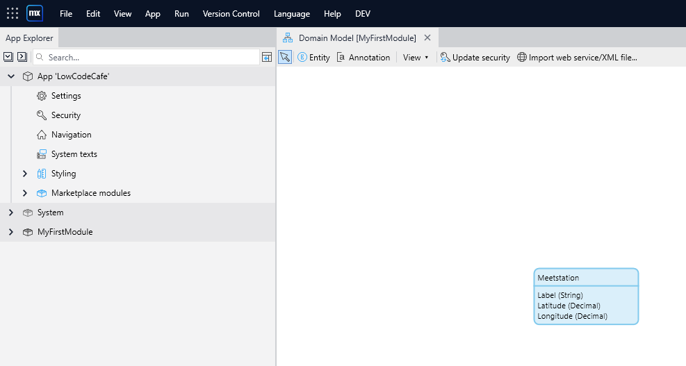
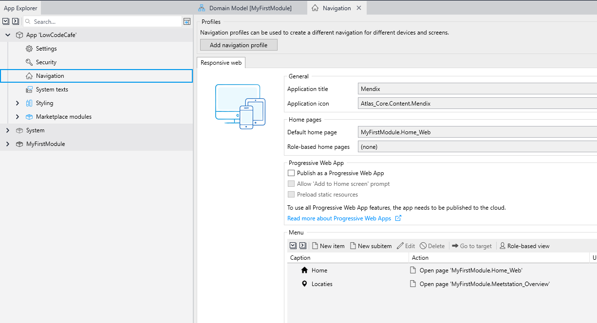

# Locaties opvoeren

> Als gebruiker wil ik locaties in de app kunnen invoeren, zodat ik later voor die locatie de luchtkwaliteit kan ophalen.

- Bij een locatie moeten minimaal de volgende eigenschappen worden opgevoerd:
  - Label (String)
  - Latitude (Decimal)
  - Longitude (Decimal)
- De opgevoerde locaties moeten een kaartje op de homepagina worden weergegeven

Voorbeeldlocaties:
- Herculesplein (52.07792913, 5.14323121)
- Spaklerweg, 52.33129118, 4.92328272

# Hints
- Maak een `Entity` aan met de benodigde attributen

    

- Maak een scherm aan waarin je de locaties kunt beheren. Tip: right-click op de `Entity`
- Zorg dat je deze beheerpagina kunt bereiken via de `Navigation`

    

- Run de app met het groene "play" icoontje rechtsbovenin Studio Pro.
