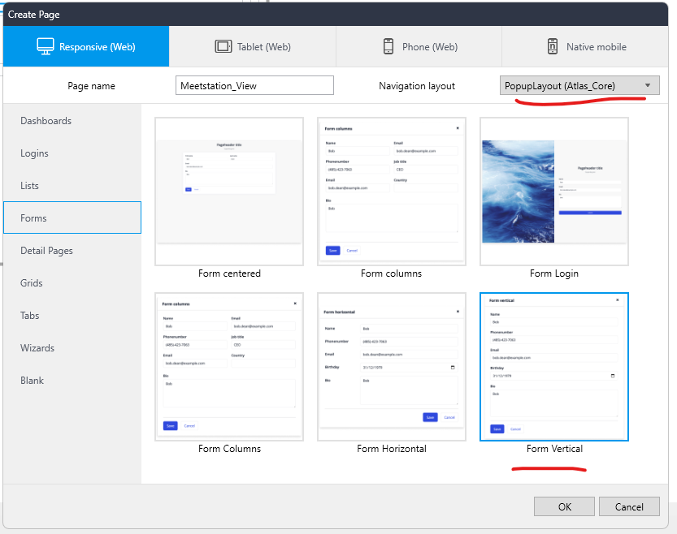
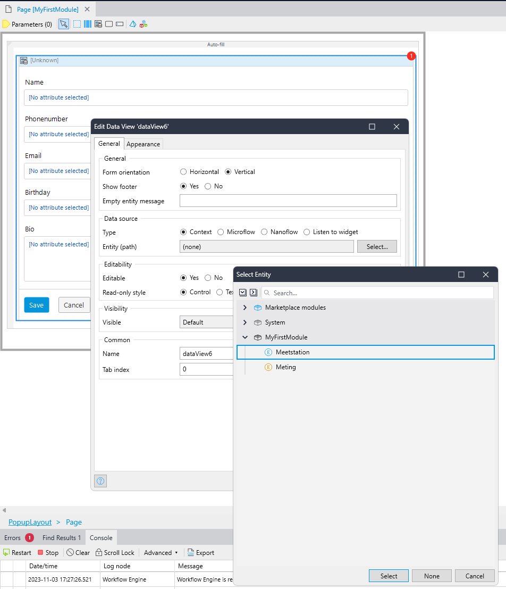
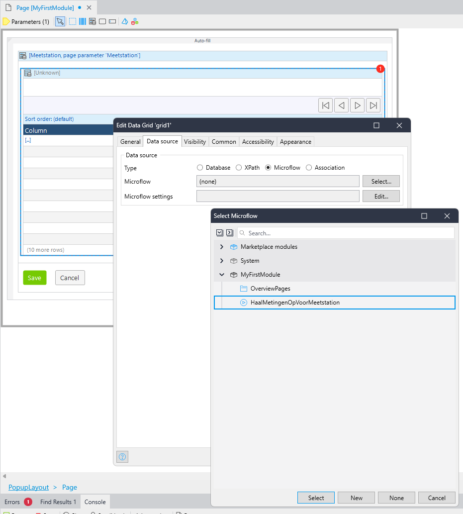
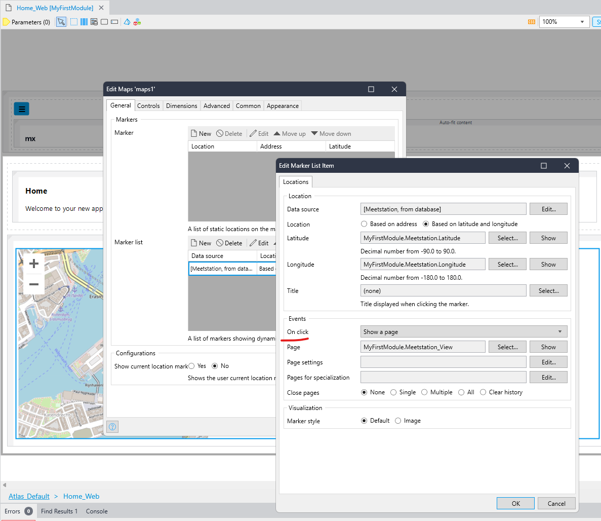

## De luchtkwaliteit ophalen
> Als gebruiker wil ik de luchtkwaliteit op een locatie ophalen zodat ik kan zien of het lekker is om daar een ommetje te maken

- Deze informatie moet opgehaald worden als ik op een marker op de kaart klik
- De informatie moet worden getoond in een popup scherm
- Gebruik de luchtmeetnet API:
  - https://api.luchtmeetnet.nl/open_api/concentrations?formula=LKI&longitude={1}&latitude={2}
- Bonus: geef de metingen weer in een grafiek in plaats van tabel

### Hints
- Maak een nieuwe popup-pagina

  

- Kies de meetstation `Entity` als `Context` van de `Data view`

  

- Voeg een `Data Grid` toe binnen de `Data View`
- Stel de `Data Source` in op `Microflow`, kies 'New' en geef de microflow een logische naam (bijvoorbeeld MetingenOphalen)

  

- Laat de kolommen automatisch invullen.
- Laat geen automatische controls aanmaken

- Stel de pagina in als `On click event` bij de Markers op de kaart

  

- Run de app